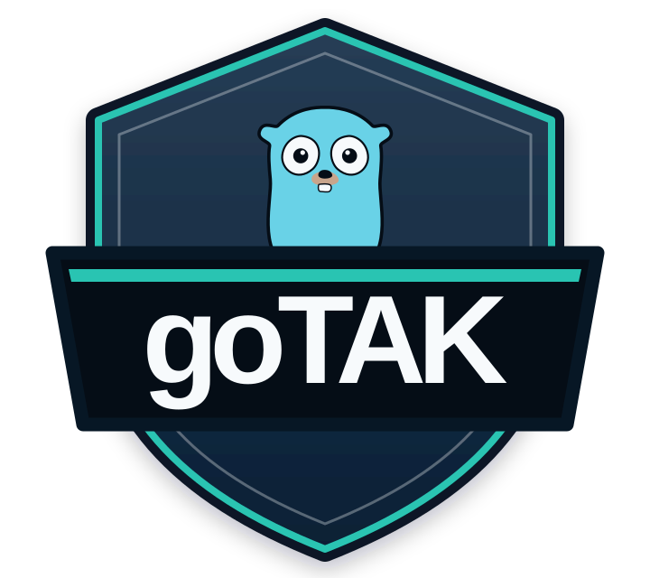

<p align="center">
  
</p>

# goTAK

goTAK is a lightweight Go CLI for development and testing against a TAK server. It enrolls for an
in-memory client certificate, opens a verified mTLS Cursor-on-Target (CoT) stream, and sends simulated straight, orbiting, or race-track positions until stopped.

See the [User Guide](USER_GUIDE.md) for configuration, interactive menus, scenario authoring, connection behavior, and troubleshooting. Release history is recorded in the [Changelog](CHANGELOG.md).

## Requirements

- Go 1.24.7 or later.
- A TAK server reachable on ports `8446` and `8089`.
- Valid certificate-enrollment credentials.

## Run

From the repository root:

```sh
go run ./cmd/gotak \
  -server <server-ip-or-hostname> \
  -username <username> \
  -password <password>
```

Choose a location and scenario from the menus, then press Ctrl+C to stop the simulation.

To skip the menus:

```sh
go run ./cmd/gotak \
  -server 192.168.1.50 \
  -username dev \
  -password devpass \
  -location "Austin, TX" \
  -scenario scenarios/austin-capitol-helicopters.json
```

To use `.env`, create it from the example and run without connection flags:

```sh
cp .env.example .env
go run ./cmd/gotak
```

## Build and Run

```sh
go build -o gotak ./cmd/gotak
./gotak -server <server-ip-or-hostname> -username <username> -password <password>
```